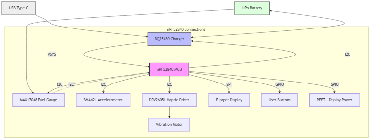
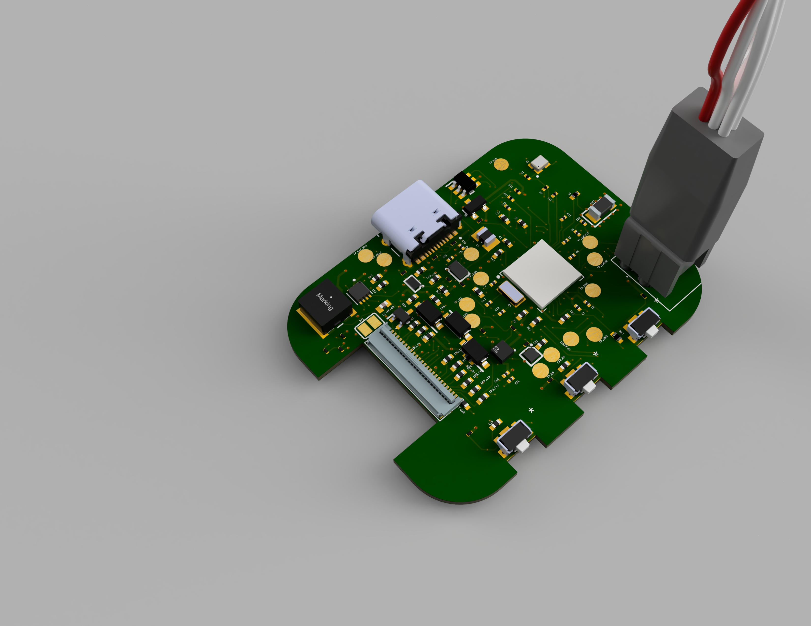
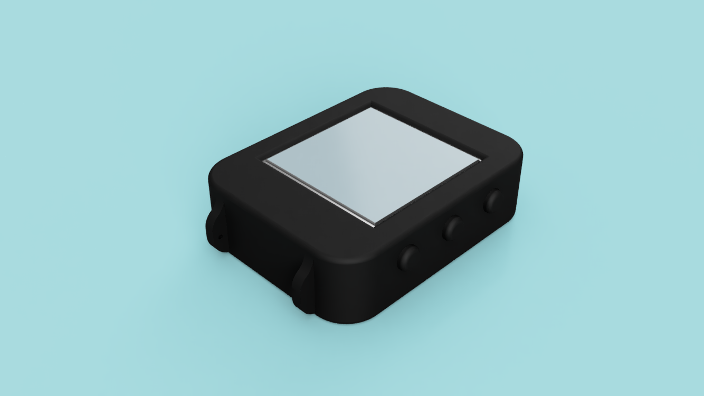
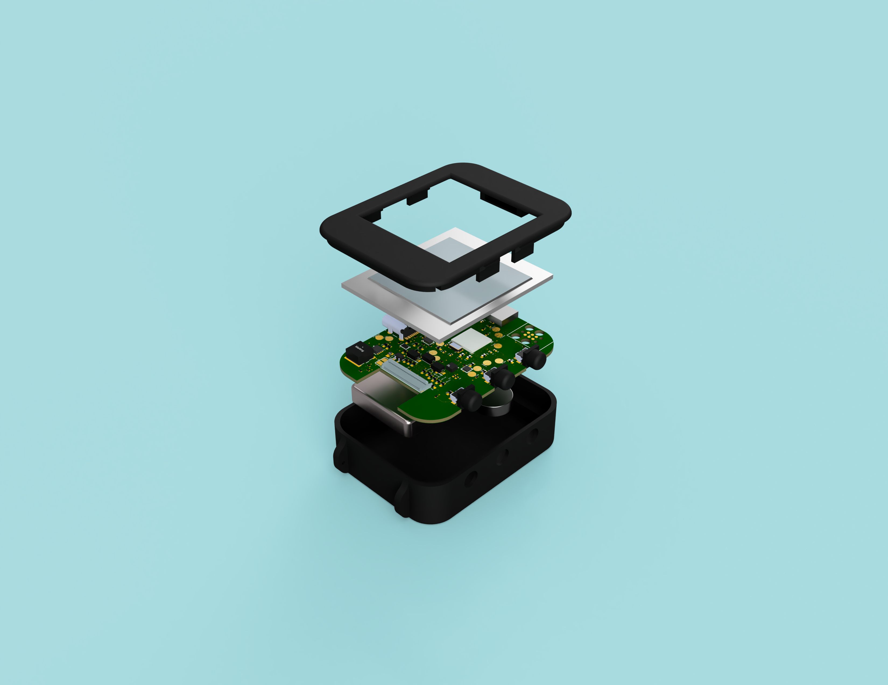

# Overview - Hector Watch

Proiectul **Hector Watch** vizează dezvoltarea unui smartwatch, optimizat pentru consum redus de energie. Sistemul este construit în jurul microcontrolerului **nRF52840** și utilizează un afișaj de tip **e-Paper** de 1.54 inch.

### 1. Arhitectura Hardware și Selecția Componentelor
Această etapă a constat în definirea specificațiilor și alegerea componentelor pentru eficiență energetică maximă:
* **Unitate centrală:** nRF52840 (SoC cu suport BLE 5.3).
* **Afișaj:** Panou E-Ink Waveshare 1.54".
* **Senzori și Feedback:** Accelerometru Bosch BMA423 (I2C) și driver haptic TI DRV2605.
* **Sursă de energie:** Baterie Li-Po 250mAh .

## Functional Architecture

Arhitectura funcțională este proiectată pentru a maximiza eficiența energetică și a asigura o comunicare fluidă între procesorul central și perifericele specializate.

### 1. Sistemul de Management al Energiei (PMU)
Acest subsistem asigură alimentarea continuă și protecția circuitelor:
* **Input:** USB-C (5V) pentru încărcare.
* **Încărcare și Protecție:** Realizată prin IC1 , care gestionează ciclul de încărcare al bateriei Li-Po.
* **Monitorizare (Fuel Gauge): U3 raportează starea de încărcare (SoC) și tensiunea bateriei prin I2C.
* **Reglare:** IC2 (Buck-Boost) transformă tensiunea variabilă a bateriei într-o tensiune stabilă de **3.3V** pentru restul componentelor.

### 2. Procesare și Conectivitate
* **Core:** **nRF52840** (ARM Cortex-M4F) rulează logica ceasului și gestionează stack-ul de Bluetooth Low Energy (BLE).
* **Timing:** Cristale externe de 32MHz (precizie procesor) și 32.768kHz (precizie ceas/RTC în mod sleep).

### 3. Interfața Om-Mașină (HMI)
* **Output Vizual:** Ecranul **E-Ink** (cerneală electronică) reține imaginea fără consum de curent, fiind actualizat prin protocolul **SPI**. 
* **Output Haptic:** Driver-ul U2 traduce comenzile I2C în vibrații mecanice prin motorul de tip coin.
* **Input:** Trei butoane fizice (GPIO) pentru navigare și interacțiune.

### 4. Subsistemul de Senzori
* Accelerometrul **BMA423** monitorizează activitatea fizică și detectează orientarea încheieturii pentru activarea ecranului.

### Block Diagram

### Matricea de Comunicație (Data Bus)

| Bus | Periferic | Tip | Rol |
| :--- | :--- | :--- | :--- |
| **SPI** | E-Paper Display | Master -> Slave | Transfer rapid de buffere de imagine |
| **I2C** | BMA423, DRV2605, MAX17048, BQ25180 | Multimaster | Configurare senzori și citire telemetrie baterie |
| **GPIO** | Butoane, Display Power (PFET), Motor EN | Digital I/O | Control direct și evenimente asincrone |

### Bill of Materials

| Referință | Componentă | Funcție | Package | JLC Code | Datasheet |
| :--- | :--- | :--- | :--- | :--- | :--- |
| **IC1 (U1)** | nRF52840-QIAA | Procesor principal (MCU) și controller Bluetooth. | aQFN73 | C190740 | [Link](https://jlcpcb.com/api/file/downloadByFileSystemAccessId/8588884082339532800) |
| **IC2 (U2)** | BQ25180YBGR | Încărcător de baterie inteligent. | WLCSP-8 | C2907431 | [Link](https://www.ti.com/cn/lit/gpn/bq25180) |
| **IC3 (U3)** | MAX17048G+T10 | Monitorizează nivelul bateriei (Fuel Gauge). | TDFN-8 | C72035 | [Link](https://jlc-prod-smt.oss-eu-central-1.aliyuncs.com/smtDataManualFile/8588907428515614720-C2682616.pdf?response-content-disposition=attachment%3B%20filename%3DC2682616.pdf%3B%20filename%2A%3DUTF-8%27%27C2682616.pdf&x-oss-date=20260421T112544Z&x-oss-expires=1800&x-oss-security-token=CAISgAN1q6Ft5B2yfSjIr5n4OcKMmaVj5%2FfYekzrr2IHQf9m3ZfGjzz2IHhMdHJsAOodtv0%2FmmhT6PkclqRLcbhpcmfjV%2BZHzLB8qcVSq2Ny4J7b16cNrbH4M4H6aXeirtuwDsz9SNTCALjPD3nPii50x5bjaDymRCbLGJaViJlhHLN1Ow6jdmhpCctxLAlvo9NgFxm3D%2Fu2NQPwiWf9FVdhvhEG6Vly8qOi2MaRmFy8yFTx0b0SvJ%2BjYMrmPctoN9JnSdC5mfdzau3a1TJ84gRD0a5wkaVA1zbDs5bfISEIuUzebreLqY03dV4mOvdqIcMe8qigz88fk%2FfIioH6xyxKOexoSCnFTOiiupCcQLPyao9jLu6iayqViY7QaIOTqQohZmkAMwVOasAsI3Ngh4zF97Qt0cVNkXO9gWfLI8DtuMleWqrqV%2FhfznSgc5lCkRRYwGs1287ugXlSQzo890KPDAEovaKCnZ2ZSfh7Y4sNknI6i%2Bfc2Se2MIkIzFMa4qKWD5sagAGLzp3fHP9zsDxV2%2FJMGJhYD%2FSIjxpKz7fqt2nFmhY%2BY1WslVCo8Aeg8t%2FASS7YFDik2EKmA7r2Qpp7S9DhCxHh3UmkIh5jq2t2qTGkqx1qYPq5E3JFwFQNyBq2LNYj5F%2B%2BlRwX66i2djJKGm9qTW%2FuuXCYOKChaO82y5rYRjpzLyAA&x-oss-signature-version=OSS4-HMAC-SHA256&x-oss-credential=STS.NZMrx8tzBP53xjZKbRMpJ2Rmm%2F20260421%2Feu-central-1%2Foss%2Faliyun_v4_request&x-oss-signature=e0bf51dc5869d52ac2c81a85deb4332a4d147174e99a754ec8a8e7ac85831cb3) |
| **IC4 (U4)** | DRV2605YZFR | Driver specializat pentru efecte haptice. | BGA-9 | C156475 | [Link](https://www.ti.com/cn/lit/gpn/drv2605) |
| **IC5 (U5)** | BMA423 | Senzor de mișcare (pași/gesturi). | LGA-12 | C406450 | [Link](https://jlc-prod-smt.oss-eu-central-1.aliyuncs.com/smtDataManualFile/8588894317138628608-C189517.pdf?response-content-disposition=attachment%3B%20filename%3DC189517.pdf%3B%20filename%2A%3DUTF-8%27%27C189517.pdf&x-oss-date=20260421T112629Z&x-oss-expires=1800&x-oss-security-token=CAISgAN1q6Ft5B2yfSjIr5n4OcKMmaVj5%2FfYekzrr2IHQf9m3ZfGjzz2IHhMdHJsAOodtv0%2FmmhT6PkclqRLcbhpcmfjV%2BZHzLB8qcVSq2Ny4J7b16cNrbH4M4H6aXeirtuwDsz9SNTCALjPD3nPii50x5bjaDymRCbLGJaViJlhHLN1Ow6jdmhpCctxLAlvo9NgFxm3D%2Fu2NQPwiWf9FVdhvhEG6Vly8qOi2MaRmFy8yFTx0b0SvJ%2BjYMrmPctoN9JnSdC5mfdzau3a1TJ84gRD0a5wkaVA1zbDs5bfISEIuUzebreLqY03dV4mOvdqIcMe8qigz88fk%2FfIioH6xyxKOexoSCnFTOiiupCcQLPyao9jLu6iayqViY7QaIOTqQohZmkAMwVOasAsI3Ngh4zF97Qt0cVNkXO9gWfLI8DtuMleWqrqV%2FhfznSgc5lCkRRYwGs1287ugXlSQzo890KPDAEovaKCnZ2ZSfh7Y4sNknI6i%2Bfc2Se2MIkIzFMa4qKWD5sagAGLzp3fHP9zsDxV2%2FJMGJhYD%2FSIjxpKz7fqt2nFmhY%2BY1WslVCo8Aeg8t%2FASS7YFDik2EKmA7r2Qpp7S9DhCxHh3UmkIh5jq2t2qTGkqx1qYPq5E3JFwFQNyBq2LNYj5F%2B%2BlRwX66i2djJKGm9qTW%2FuuXCYOKChaO82y5rYRjpzLyAA&x-oss-signature-version=OSS4-HMAC-SHA256&x-oss-credential=STS.NZMrx8tzBP53xjZKbRMpJ2Rmm%2F20260421%2Feu-central-1%2Foss%2Faliyun_v4_request&x-oss-signature=1b2c6936aa63600c7496d9337576edecc9ae5bf56b8ef562c67036a6727a361c) |
| **IC6 (U6)** | RT6160AWSC | Regulator Buck-Boost (3.3V stabil). | WLCSP-15 | C141692 | [Link](https://jlcpcb.com/api/file/downloadByFileSystemAccessId/8600398231234883584) |
| **IC7 (U7)** | USBLC6-2SC6Y | Protecție ESD la mufa USB. | SOT-23-6L | C7519 | [Link](https://jlc-prod-smt.oss-eu-central-1.aliyuncs.com/smtDataManualFile/8603165824283140096-C2969755.pdf?response-content-disposition=attachment%3B%20filename%3DC2969755.pdf%3B%20filename%2A%3DUTF-8%27%27C2969755.pdf&x-oss-date=20260421T112712Z&x-oss-expires=1800&x-oss-security-token=CAISgAN1q6Ft5B2yfSjIr5n4OcKMmaVj5%2FfYekzrr2IHQf9m3ZfGjzz2IHhMdHJsAOodtv0%2FmmhT6PkclqRLcbhpcmfjV%2BZHzLB8qcVSq2Ny4J7b16cNrbH4M4H6aXeirtuwDsz9SNTCALjPD3nPii50x5bjaDymRCbLGJaViJlhHLN1Ow6jdmhpCctxLAlvo9NgFxm3D%2Fu2NQPwiWf9FVdhvhEG6Vly8qOi2MaRmFy8yFTx0b0SvJ%2BjYMrmPctoN9JnSdC5mfdzau3a1TJ84gRD0a5wkaVA1zbDs5bfISEIuUzebreLqY03dV4mOvdqIcMe8qigz88fk%2FfIioH6xyxKOexoSCnFTOiiupCcQLPyao9jLu6iayqViY7QaIOTqQohZmkAMwVOasAsI3Ngh4zF97Qt0cVNkXO9gWfLI8DtuMleWqrqV%2FhfznSgc5lCkRRYwGs1287ugXlSQzo890KPDAEovaKCnZ2ZSfh7Y4sNknI6i%2Bfc2Se2MIkIzFMa4qKWD5sagAGLzp3fHP9zsDxV2%2FJMGJhYD%2FSIjxpKz7fqt2nFmhY%2BY1WslVCo8Aeg8t%2FASS7YFDik2EKmA7r2Qpp7S9DhCxHh3UmkIh5jq2t2qTGkqx1qYPq5E3JFwFQNyBq2LNYj5F%2B%2BlRwX66i2djJKGm9qTW%2FuuXCYOKChaO82y5rYRjpzLyAA&x-oss-signature-version=OSS4-HMAC-SHA256&x-oss-credential=STS.NZMrx8tzBP53xjZKbRMpJ2Rmm%2F20260421%2Feu-central-1%2Foss%2Faliyun_v4_request&x-oss-signature=3bd40d510d9216cc6425f6a729325acb3ecaeffaa7238b5506b9054adb73b786) |
| **X1** | ECS-320-10-33B | Cristal 32MHz pentru Bluetooth. | 3225 SMD | C110292 | [Link](https://www.google.com/search?q=https://ecsxtal.com/store/pdf/ECS-320-10-33B-CKM.pdf) |
| **X2** | NX3215SA | Cristal 32.768kHz pentru RTC. | 3215 SMD | C32156 | [Link](https://www.ndk.com/images/products/catalog/c_NX3215SA_e.pdf) |
| **D1** | MBR0530 | Diodă Schottky pentru protecție curent. | SOD-123 | C8200 | [Link](https://www.onsemi.com/pdf/datasheet/mbr0530t1-d.pdf) |
| **D2-D5** | Generic 0402 | LED-uri stare (încărcare/notificări). | 0402 SMD | - | - |
| **L1** | MLP2016H2R2MT | Inductor Power pentru RT6160. | 2016 SMD | C135431 | [Link](https://product.tdk.com/system/files/dam/doc/product/inductor/inductor/smd/catalog/inductor_commercial_power_mlp2016_en.pdf) |
| **Q1** | SI1308EDL | Switch logic pentru alimentare display. | SOT-23 | C140222 | [Link](https://www.vishay.com/docs/63399/si1308edl.pdf) |
| **Resistors** | C3920633 | Pull-up I2C și limitare LED. | 0201 | **C3920633** | - |
| **Capacitors**| C9900156064 | Filtrare și decuplare generală. | 0201 | **C9900156064** | - |
| **C23, 27..** | C21012218 | Stabilitate tensiune. | - | **C21012218** | - |
| **C24, 25..** | C9900179830 | Filtrare intrare/ieșire putere. | 0402 | **C9900179830** | - |
| **DISP** | Waveshare 1.54" | Ecran principal E-Ink. | 37.3x31.8 mm | - | [Link PDF](https://www.waveshare.com/w/upload/7/77/1.54inch_e-Paper_Datasheet.pdf?srsltid=AfmBOorvr9QUc2F2yPCG9JTKScM4Ca_KRrmOvzZPdTIs-fBF9CH1EZh_) |
| **BATT** | Akyga LP502030 | Sursă energie (250mAh). | 32.5x21 mm | - | [Link](https://files.elektroniksc.com.pl/14017-2427914986/LP502030.pdf) |
| **MOT** | FIT0774 | Motor vibrații haptic. | Ø10 x 3 mm | - | [Link](https://jlc-prod-smt.oss-eu-central-1.aliyuncs.com/smtDataManualFile/8600542373223424000-C17569954.pdf?response-content-disposition=attachment%3B%20filename%3DC17569954.pdf%3B%20filename%2A%3DUTF-8%27%27C17569954.pdf&x-oss-date=20260421T113148Z&x-oss-expires=1800&x-oss-security-token=CAISgAN1q6Ft5B2yfSjIr5n4OcKMmaVj5%2FfYekzrr2IHQf9m3ZfGjzz2IHhMdHJsAOodtv0%2FmmhT6PkclqRLcbhpcmfjV%2BZHzLB8qcVSq2Ny4J7b16cNrbH4M4H6aXeirtuwDsz9SNTCALjPD3nPii50x5bjaDymRCbLGJaViJlhHLN1Ow6jdmhpCctxLAlvo9NgFxm3D%2Fu2NQPwiWf9FVdhvhEG6Vly8qOi2MaRmFy8yFTx0b0SvJ%2BjYMrmPctoN9JnSdC5mfdzau3a1TJ84gRD0a5wkaVA1zbDs5bfISEIuUzebreLqY03dV4mOvdqIcMe8qigz88fk%2FfIioH6xyxKOexoSCnFTOiiupCcQLPyao9jLu6iayqViY7QaIOTqQohZmkAMwVOasAsI3Ngh4zF97Qt0cVNkXO9gWfLI8DtuMleWqrqV%2FhfznSgc5lCkRRYwGs1287ugXlSQzo890KPDAEovaKCnZ2ZSfh7Y4sNknI6i%2Bfc2Se2MIkIzFMa4qKWD5sagAGLzp3fHP9zsDxV2%2FJMGJhYD%2FSIjxpKz7fqt2nFmhY%2BY1WslVCo8Aeg8t%2FASS7YFDik2EKmA7r2Qpp7S9DhCxHh3UmkIh5jq2t2qTGkqx1qYPq5E3JFwFQNyBq2LNYj5F%2B%2BlRwX66i2djJKGm9qTW%2FuuXCYOKChaO82y5rYRjpzLyAA&x-oss-signature-version=OSS4-HMAC-SHA256&x-oss-credential=STS.NZMrx8tzBP53xjZKbRMpJ2Rmm%2F20260421%2Feu-central-1%2Foss%2Faliyun_v4_request&x-oss-signature=3123648a1255a4bcd5d4fe98690891d424c0b7d99660a32dc277129baedf181c) |
| **USB** | KH-TYPE-C-16P | Port încărcare și date USB-C. | 16-pin SMD | C165948 | [Link](https://www.snapeda.com/parts/KH-TYPE-C-16P/kinghelm/datasheet/) |
| **J1** | 503480-2400 | Conector FPC (Display). | 0.5mm Pitch | C262524 | [Link](https://www.molex.com/en-us/products/part-detail/5034802400) |
| **ANT** | 2450AT18B100E | Antenă Bluetooth 2.4GHz. | 3216 SMD | C105151 | [Link](https://www.johansontechnology.com/datasheets/2450AT18B100.pdf) |
| **BTN** | EVP-AKE31A | Butoane navigare meniu. | 3.8x1.9 mm | C138127 | [Link](hhttps://jlc-prod-smt.oss-eu-central-1.aliyuncs.com/smtDataManualFile/8588931144787611648-C569760.pdf?response-content-disposition=attachment%3B%20filename%3DC569760.pdf%3B%20filename%2A%3DUTF-8%27%27C569760.pdf&x-oss-date=20260421T113342Z&x-oss-expires=1800&x-oss-security-token=CAISgAN1q6Ft5B2yfSjIr5n4OcKMmaVj5%2FfYekzrr2IHQf9m3ZfGjzz2IHhMdHJsAOodtv0%2FmmhT6PkclqRLcbhpcmfjV%2BZHzLB8qcVSq2Ny4J7b16cNrbH4M4H6aXeirtuwDsz9SNTCALjPD3nPii50x5bjaDymRCbLGJaViJlhHLN1Ow6jdmhpCctxLAlvo9NgFxm3D%2Fu2NQPwiWf9FVdhvhEG6Vly8qOi2MaRmFy8yFTx0b0SvJ%2BjYMrmPctoN9JnSdC5mfdzau3a1TJ84gRD0a5wkaVA1zbDs5bfISEIuUzebreLqY03dV4mOvdqIcMe8qigz88fk%2FfIioH6xyxKOexoSCnFTOiiupCcQLPyao9jLu6iayqViY7QaIOTqQohZmkAMwVOasAsI3Ngh4zF97Qt0cVNkXO9gWfLI8DtuMleWqrqV%2FhfznSgc5lCkRRYwGs1287ugXlSQzo890KPDAEovaKCnZ2ZSfh7Y4sNknI6i%2Bfc2Se2MIkIzFMa4qKWD5sagAGLzp3fHP9zsDxV2%2FJMGJhYD%2FSIjxpKz7fqt2nFmhY%2BY1WslVCo8Aeg8t%2FASS7YFDik2EKmA7r2Qpp7S9DhCxHh3UmkIh5jq2t2qTGkqx1qYPq5E3JFwFQNyBq2LNYj5F%2B%2BlRwX66i2djJKGm9qTW%2FuuXCYOKChaO82y5rYRjpzLyAA&x-oss-signature-version=OSS4-HMAC-SHA256&x-oss-credential=STS.NZMrx8tzBP53xjZKbRMpJ2Rmm%2F20260421%2Feu-central-1%2Foss%2Faliyun_v4_request&x-oss-signature=de82d2c18fd97c4e0818f889d880a6cdc2a8298c582eb4e00e03563dc11a3a5e) |
| **PROG** | TC2030-IDC | Interfață programare (Tag-Connect). | Plug-of-Nails | - | [Link](https://www.snapeda.com/parts/TC2030-IDC/Tag-Connect%20LLC/datasheet/) |

## nRF52840 Pin Mapping

### 1. Magistrala I2C (Senzori și Management Energie)
Această magistrală este utilizată pentru comunicarea cu majoritatea componentelor inteligente din sistem.
* **P0.26:** Linia de date **SDA**. Conectează:
    * **IC1** (Charger BQ25180)
    * **IC3** (IMU BMA421)
    * **U3** (Fuel Gauge MAX17048)
    * **IC2** (Haptic Driver DRV2605)
* **P0.27:** Linia de ceas **SCL**

### 2. Interfața SPI și Control (E-Paper Display)
Conexiunile către conectorul **J1** (E-Paper Display Connector)
* **P0.05:** EPD_SCK (Ceas SPI).
* **P0.07:** EPD_MOSI (Date SPI)
* **P0.12:** EPD_CS (Chip Select)
* **P0.11:** EPD_DC (Data/Command control)
* **P0.04:** EPD_RST (Reset Display).
* **P0.08:** EPD_BUSY (Semnal stare display).
* **P0.31:** **PWR_EPD_CTRL** – Controlează tranzistorul **Q1** pentru a activa/dezactiva alimentarea întregului circuit de display

### 3. Interfață Utilizator (Butoane și Haptic)
* **P1.00:** Buton **SW_UP**
* **P1.01:** Buton **SW_ENT** (Enter/Select)
* **P1.02:** Buton **SW_DN** (Down)
* **P0.29:** **HAPTIC_EN / INTRIG** – Pinul de declanșare pentru driverul de vibrații **IC2**

### 4. Sistem și Debug
* **P0.18 / RESET:** Pinul de reset hardware, conectat la interfața de programare.
* **SWDIO / SWCLK:** Pinii de programare și depanare prin interfața **SWD**, conectați la mufa **TC2030**
* **ANT:** Pinul dedicat pentru ieșirea radio, conectat la antena chip de 2.4GHz (**ANT1**)

### 5. Alimentare (Power Rails)
* **VDD / VDDH:** Alimentarea principală de **3.3V** provenită de la regulatorul DC/DC
* **VSS:** Conexiunile la masă (**GND**)

## Design Considerations
* **Componente doar pe TOP:** Toate piesele sunt pe o singură față pentru asamblare rapidă și ieftină.
* **Plane de GND:** Cupru pe ambele părți pentru protecție și semnal fără zgomot.
* **Via stitching:** Găuri multe lângă antenă pentru a bloca interferențele radio.
* **Decuplare:** Condensatori puși fix lângă pini pentru un curent cât mai stabil.
* **Keepout antenă:** Zonă fără cupru sub antenă pentru semnal Bluetooth maxim.
* **Baterie fără JST:** Baterie lipită direct, fără mufă, pentru a face ceasul cât mai subțire.

## Design Rule Check (DRC) Exceptions
| Tip eroare                         | Componentă                            | Explicație simplă                                                                                  |
| ---------------------------------- | ------------------------------------- | -------------------------------------------------------------------------------------------------- |
| Solid Polygon Shape - Pad Overlap  | Butoane tactile / planuri de cupru    | Suprapunerea este din cauza amplasarii butoanelor.                                                 |
| SMD-Via Overlap                    | nRF52840 (CPU)                        | Via-in-pad este necesar la acest procesor, fiindcă are pini mulți și spațiu foarte mic.            |
| Wire Copper Width                  | Trasee de putere / intrări componente | Traseele se îngustează local ca să poată intra între pini fără să facă scurt.  [necking]           |
| Wire/Via Copper Clearance          | Rutare internă CPU                    | Distanțele sunt mai mici din lipsă de spațiu, dar sunt încă în limitele acceptate de fabricație.   |
| SMD-Hole / Board Outline Clearance | USB Type-C / margine PCB              | Conectorul USB-C este pus aproape de margine pentru a se potrivi corect cu decupajul carcasei.     |

## Hardware Renderings & Visuals
### Final PCB Layout

### Final Design Render

### Final Design Explored
